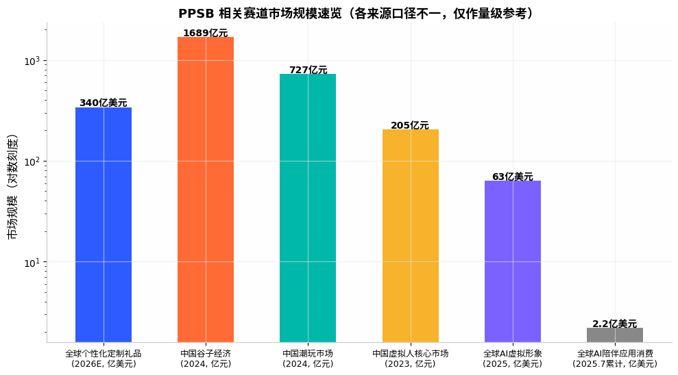
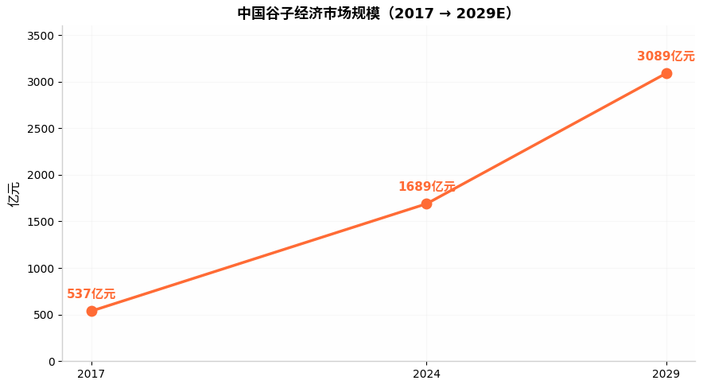
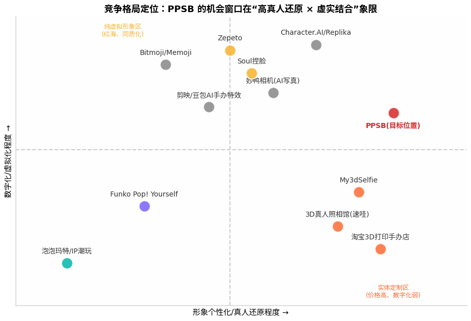
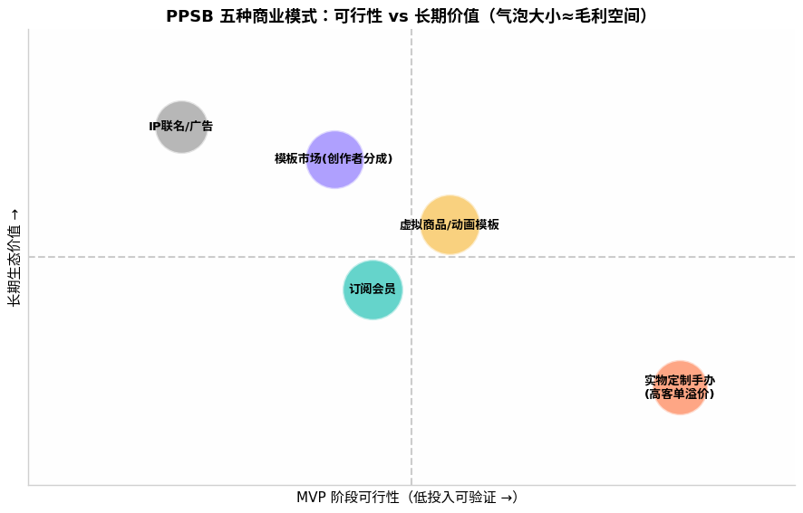

# PPSB 项目市场与竞品深度研究报告

> 项目代号：PPSB ——「人人拥有、创造并活化数字分身」的虚实结合平台
> 报告日期：2026年8月 · 数据截至 2024–2026 年公开资料
> 用途：Phase 0 决策依据 —— 判断市场机会、竞争格局与第一步行动

---

## 目录

1. 执行摘要（核心结论先行）
2. 市场规模与趋势
3. 用户需求与画像
4. 竞品深度分析（直接 / 间接 / 替代品 / 大厂威胁）
5. 商业模式与盈利性验证
6. 壁垒与风险评估
7. 机会点与战略建议
8. 最终结论

---

## 一、执行摘要

**一句话结论：这个项目值得做，但不值得按"平台"的剧本做——至少现在不值得。**

PPSB 所处的真实位置是三条增长曲线的交汇点：**中国潮玩/谷子经济（2024 年 1689 亿元、同比 +40.6%） [(新华网)](https://www.news.cn/fashion/20260403/b0afb71fbfa84ed299fdef4b3c193e94/c.html) **、**全球个性化定制礼品市场（约 280–340 亿美元、CAGR 6.7%–8.5%） [(Market Reports World)](https://www.marketreportsworld.com/zh/market-reports/personalized-or-custom-gift-market-14719821) **、**AI 3D 生成技术拐点（Meshy ARR 6000 万美元、Tripo 月访问量 2700 万+，2026 年跨过"生产级"临界值） [(cyzone.cn)](https://m.cyzone.cn/article/840683.html) **。需求侧已被反复验证：Zepeto 注册用户超 4 亿、虚拟商品累计售出 24 亿件以上  [(kedglobal.com)](https://www.kedglobal.com/metaverse/newsView/ked202203040009) ；淘宝"照片定制 3D 手办"类目已有数千 SKU 且多个单品月销数百件  [(淘宝)](https://www.taobao.com/chanpin/4ffe82eee16ae7aff066a5b1fc730065a34a48e24d882b5bea4fa1327ca1e932.html) ；2025 年 GPT-4o "玩偶盲盒"风潮与豆包 Seedream 4.0 的手办图生成证明了"把自己变成手办"是自发、病毒式的需求  [(bigbigwork.com)](https://blog.bigbigwork.com/archives/202504275) 。

但三个残酷事实同样清晰：

1. **纯虚拟形象赛道是红海且已被证伪商业模式**——Zepeto 母公司 NAVER Z 年收入约 4629 万美元却 EBITDA 为 -4251 万美元  [(Preqin)](https://www.preqin.com/data/profile/asset/zepeto/394765) ；妙鸭相机 9.9 元数字分身爆红后迅速陨落、团队解散，证明"一次性虚拟分身"没有复购  [(新京报)](https://m.bjnews.com.cn/detail/1779353283129260.html) 。
2. **纯实体定制已有廉价供给**——淘宝全彩树脂真人手办 ¥99–738 已大量存在，PPSB 在实物端没有结构性成本优势  [(淘宝逛一逛)](https://guangtao.taobao.com/product-77207c33d952a653f8fd2960cd40eec4297a31d5289039f5e0e67401e828a68d.html) 。
3. **真正未被占据的生态位是"虚拟分身 → 实体手办"的闭环体验**：虚拟端做流量、社交裂变与低成本试错，实体端做高毛利变现与情感锚点。目前没有任何一个玩家同时做好两端（详见竞品定位图）。

**建议的第一步**：以"毕业季/情侣礼物"为单点场景做 4–6 周 MVP，不建平台、不建 App，用微信小程序 + 现成 AI 3D 生成 API + 珠三角全彩 3D 打印代工，验证三个核心假设：① 虚拟形象生成→分享率 >25%；② 虚拟→实体付费转化率 >8%；③ 单均履约成本 <售价 40%。全部达标再谈社区与平台。

---

## 二、市场规模与趋势

### 2.1 三个相关市场的规模与增速

PPSB 横跨三个市场，其可及市场（TAM/SAM）应分层理解：

| 市场 | 最新规模 | 增速 | 与 PPSB 的相关度 |
|---|---|---|---|
| 全球个性化定制礼品 | 2024 年约 283 亿美元；2026 年约 340 亿美元，预计 2035 年达 616 亿美元  [(Market Reports World)](https://www.marketreportsworld.com/zh/market-reports/personalized-or-custom-gift-market-14719821)  | CAGR 6.7%–8.5%  [(Business Research Insights)](https://www.businessresearchinsights.com/market-reports/personalized-gifts-market-102185)  | ★★★★ 实体定制的总盘 |
| 中国潮玩市场 | 2024 年 727 亿元  [(微信公众号(M123跨境工具导航))](http://mp.weixin.qq.com/s?__biz=Mzg5MDg4OTY2NA==&mid=2247498619&idx=1&sn=408c4c9cb43d2a5184d8c82526cd1c7b)  | +26%（2024） [(微信公众号(M123跨境工具导航))](http://mp.weixin.qq.com/s?__biz=Mzg5MDg4OTY2NA==&mid=2247498619&idx=1&sn=408c4c9cb43d2a5184d8c82526cd1c7b)  | ★★★★ 手办形态与定价参照 |
| 中国谷子经济 | 2024 年 1689 亿元，预计 2029 年超 3000 亿元  [(新华网)](https://www.news.cn/fashion/20260403/b0afb71fbfa84ed299fdef4b3c193e94/c.html)  | +40.6%（2024） [(新华网)](https://www.news.cn/fashion/20260403/b0afb71fbfa84ed299fdef4b3c193e94/c.html)  | ★★★★★ 情感消费+晒单文化的直接证据 |
| 中国虚拟人产业 | 2023 年核心市场 205.2 亿元、带动产业 3334.7 亿元；预计 2025 年核心 480.6 亿元  [(百度百科)](https://baike.baidu.com/item/2024%E5%B9%B4%E4%B8%AD%E5%9B%BD%E8%99%9A%E6%8B%9F%E6%95%B0%E5%AD%97%E4%BA%BA%E4%BA%A7%E4%B8%9A%E5%8F%91%E5%B1%95%E7%99%BD%E7%9A%AE%E4%B9%A6/64321963)  | 高增长但口径偏 B 端 | ★★ 主要为企业服务，非 C 端分身 |
| 全球 AI 虚拟形象 | 2025 年约 8–63 亿美元（不同机构口径差异大），CAGR 30%+  [(实时互动网)](https://www.nxrte.com/zixun/70695.html)  | 30.6%–32.9%  [(实时互动网)](https://www.nxrte.com/zixun/70695.html)  | ★★★ 技术供给侧信号 |
| 全球 AI 陪伴应用 | 累计下载 2.2 亿次、消费支出 2.21 亿美元（截至 2025.7） [(zhiding.cn)](https://m.zhiding.cn/article/3170397.htm)  | 收入同比 +64%  [(zhiding.cn)](https://m.zhiding.cn/article/3170397.htm)  | ★★★ "数字分身"付费意愿参照 |

需要清醒认识的两点：**其一**，这些数字大部分是"大盘"而非 PPSB 可直接切分的蛋糕——谷子经济 1689 亿元中徽章+卡牌占 70%–80%  [(什么值得买)](https://post.smzdm.com/p/an50vdr7) ，与"真人定制人偶"重叠有限。**其二**，PPSB 真实的利基市场是交叉点："个性化人像手办定制"。从供给侧反推：淘宝该细分品类头部单品月销 200–600 件、客单 ¥100–738  [(淘宝)](https://www.taobao.com/chanpin/4ffe82eee16ae7aff066a5b1fc730065a34a48e24d882b5bea4fa1327ca1e932.html) ，全国 3D 真人照相馆品牌十余家、速哇单品牌加盟店超 50 家、加盟费 23.3 万元  [(3dzyk.cn)](https://www.3dzyk.cn/thread-25104-1-1.html) ，估算国内"真人形象定制人偶"年交易规模约在 **5–20 亿元**量级，且以远超大盘的速度增长——这是一个"小而快"而非"大而稳"的市场，恰好适合早期创业项目切入。

### 2.2 核心驱动因素

**需求侧：情绪价值成为第一购买理由。** 谷子消费调研显示，64.0% 的消费者因"喜欢对应 IP/角色"购买，40.1% 将情绪价值列为首要考量，90.2% 购后主动晒单  [(什么值得买)](https://post.smzdm.com/p/an50vdr7) 。当"喜欢别人的 IP"能撑起 1689 亿市场时，"喜欢自己/朋友/伴侣的形象"这一更底层的情感动因，理论天花板不低于前者。Z 世代（18–27 岁）占虚拟形象购买用户的 50.4%、一二线城市占比超 44%  [(Soul)](https://www.soulapp.cn/media/news/-1) ，客群画像与 PPSB 目标用户高度重合。

**供给侧：AI 3D 生成在 2025–2026 年跨过"玩具→工具"临界值。** Meshy-6 与 Tripo H3.1 首次输出"生产级水密网格"，可直接进入 3D 打印管线  [(发现报告)](https://www.fxbaogao.com/detail/5479159) ；腾讯 Hunyuan3D-2.1 开源 PBR 材质方案、6GB 显存可本地运行  [(发现报告)](https://www.fxbaogao.com/detail/5479159) ；Meshy 已获近 4 亿美元 B 轮、估值超百亿人民币，ARR 达 6000 万美元、毛利率 85%  [(cyzone.cn)](https://m.cyzone.cn/article/840683.html) 。对 PPSB 的意义：**生成能力将迅速商品化，自研 3D 生成模型不再是壁垒，也不应是投入重点——调用现成 API/开源模型即可。**

**履约侧：消费级 3D 打印进入"iPhone 时刻"。** 2025 年中国 3D 打印机出口 503 万台（+33.2%）、出口额首破百亿  [(新华网)](http://www.news.cn/finance/20260409/13b1628e4e1f4df2b5453d82f86989dc/c.html) ；深圳四家企业占全球消费级出货约九成，拓竹 2025 年营收破百亿、出货破百万台  [(深圳新闻网)](https://www.sznews.com/news/content/2026-02/28/content_31959398.htm) ；入门级高速机价格被打到 199 美元  [(全天候科技)](https://awtmt.com/articles/3763820) 。全彩树脂打印的代工价格在淘宝已下探至 ¥100–400 区间  [(淘宝)](https://www.taobao.com/chanpin/4ffe82eee16ae7aff066a5b1fc730065a34a48e24d882b5bea4fa1327ca1e932.html) 。**柔性供应链已成熟到"无需自建产能"的程度**，这大幅降低了 PPSB 实体化的门槛——同时也意味着供应链本身不构成壁垒。

### 2.3 行为趋势：数字分身、情感实体化、社交分享

三个已被验证的行为信号值得单列：

- **"把自己变成手办"是病毒式自发需求。** 2025 年 4 月 GPT-4o 掀起"玩偶盲盒风潮"，用户将自拍变成限量版手办样式在全球社交网络刷屏  [(bigbigwork.com)](https://blog.bigbigwork.com/archives/202504275) ；字节豆包 Seedream 4.0 上线后，"一分钟制作 3D 手办照片"成为热门教程  [(CSDN博客)](https://blog.csdn.net/dabao_ge/article/details/151804692) 。注意：这些病毒传播的都是**2D 图片**，"生成图很爽、拿到实物无门"正是 PPSB 的切入点。
- **晒单即增长。** 谷子经济 90.2% 的晒单率  [(什么值得买)](https://post.smzdm.com/p/an50vdr7)  和妙鸭相机"朋友圈刷屏"式裂变  [(新京报)](https://m.bjnews.com.cn/detail/1779353283129260.html)  证明：形象类产品的分享属性是所有获客渠道中成本最低的。
- **情感实体化有持续付费力。** 全球照片书市场 2024 年约 44.7 亿美元、CAGR 6.5%  [(marketresearchintellect.com)](https://www.marketresearchintellect.com/zh/product/global-photobooks-market-size-and-forecast/) ；照片打印与商品市场 2025 年中国线上份额达 108 亿美元  [(360researchreports.com)](https://www.360researchreports.com/zh/market-reports/photo-printing-and-merchandise-market-207876) ——人们为"把数字记忆变成实体"持续付费的意愿是穿越周期的。

---

## 三、用户需求与画像

### 3.1 目标用户分层

| 用户层 | 画像 | 核心场景 | 付费特征 |
|---|---|---|---|
| **核心层：Z 世代女性** | 16–28 岁，一二线为主；Zepeto 70% 用户为 13–21 岁女性  [(搜狐)](https://www.sohu.com/a/588912666_115978) ，Soul 虚拟头像买家 50.4% 为 18–27 岁  [(Soul)](https://www.soulapp.cn/media/news/-1)  | 捏脸社交、情侣/闺蜜礼物、晒单 | 低客单高频（谷子单次约 102 元、月均 2.9 次） [(什么值得买)](https://post.smzdm.com/p/an50vdr7)  |
| **次核心：送礼人群** | 20–35 岁，男女皆有 | 毕业纪念、生日、七夕/情人节、结婚 | 中高客单、一年 2–4 次的"事件型"消费 |
| **延展层：亲子/宠物家庭** | 28–45 岁 | 周岁纪念、宠物手办（淘宝宠物定制 ¥380–499 有稳定销量） [(淘宝逛一逛)](https://guangtao.taobao.com/product-724d35505ca957629d37053ebf2bc8a0df3a065b1da9068cabf8a605c6ec4df7.html)  | 客单最高、决策快 |
| **创作层：捏脸师/设计师** | Soul 头部捏脸师月入 4–4.5 万元  [(北晚在线)](https://m.takefoto.cn/news/2021/11/17/10006391.shtml)  | 模板市场供给侧 | 被收益驱动，平台分成敏感 |

### 3.2 现有方案下的真实痛点

1. **传统定制"三高一长"**：3D 真人照相馆需到店扫描、加盟体系重，客单数百至上千元，周期数天至两周  [(3dzyk.cn)](https://www.3dzyk.cn/thread-25104-1-1.html) ；淘宝照片定制店靠人工建模修模，品控不稳（用户评价中"还原度 95%"已属优质反馈） [(taobao.com)](https://pcdetail.taobao.com/Y2g5WUFsVnhjUUN6M1pGWngvR3c2dz09.html) 。
2. **虚拟形象"用完即弃"**：妙鸭相机的教训极其直接——用户花 9.9 元生成数字分身后"再也没有打开过应用"，因为"没有高频需求"  [(新京报)](https://m.bjnews.com.cn/detail/1779353283129260.html) 。纯虚拟分身缺乏持续价值锚点。
3. **虚拟与实体断裂**：Zepeto/Soul 的形象无法实体化；淘宝手办店的形象无法数字化复用（换服装、做动画、二次分享）。用户在两端重复付费、体验割裂。
4. **AI 手办图"最后一公里"缺失**：2025 年手办图病毒传播后，用户想拿到真实手办只能自己去淘宝碰运气  [(bigbigwork.com)](https://blog.bigbigwork.com/archives/202504275) 。

### 3.3 付费意愿的证据链

需求强度的关键信号全部为正：

- **自发搜索与购买**：淘宝"照片定制 3D 手办"相关商品超 5000 件、多个 SKU 付款人数 100–1000+  [(淘宝)](https://www.taobao.com/chanpin/4ffe82eee16ae7aff066a5b1fc730065a34a48e24d882b5bea4fa1327ca1e932.html) ；闲鱼/淘宝上"捏脸数据"店铺热门者付款超 1000 人、单价 5–500 元  [(faceunity.com)](https://www.faceunity.com/news/11023/11127.html) 。
- **替代品消费**：Soul 虚拟头像定价 30–70 元、单作品最高售出 7764 次、交易额超 30 万元  [(人民网)](http://finance.people.com.cn/n1/2021/1115/c1004-32282860.html) ；Zepeto 虚拟商品累计售出超 24 亿件  [(kedglobal.com)](https://www.kedglobal.com/metaverse/newsView/ked202203040009) 。
- **社交晒单**：谷子经济 90.2% 晒单率  [(什么值得买)](https://post.smzdm.com/p/an50vdr7) ；妙鸭上线一周朋友圈刷屏  [(人人都是产品经理)](https://www.woshipm.com/share/5878138.html) 。
- **为"实体化"付溢价**：My3dSelfie 全彩人像 $99–199（约 ¥700–1400）在 50+ 国家售出超 1 万单  [(my3dselfie.com)](https://www.my3dselfie.com/?srsltid=AfmBOoq_EBFJO4r9PcdcrHnCl5gNdID3senDQD-H_8dyA-dd-arM0HXn) ，证明海外同样存在。

**结论：需求真实且多点验证，但"高频"是幻觉——这本质是"事件型情感消费 + 社交货币"，年人均消费次数 2–5 次，商业模式必须据此设计（高客单实体 + 低客单虚拟扩散），而非按高频 App 设计。**

---

## 四、竞品深度分析

### 4.1 竞品全景对比表

| 竞品 | 类型 | 形态 | 定价 | 规模/状态 | 对 PPSB 威胁 |
|---|---|---|---|---|---|
| 淘宝 3D 打印定制店（柚子玩物等） | 直接 | 照片→Q版/真人手办 | ¥20–738  [(淘宝逛一逛)](https://guangtao.taobao.com/product-77207c33d952a653f8fd2960cd40eec4297a31d5289039f5e0e67401e828a68d.html)  | 5000+ SKU，头部月销数百  [(淘宝)](https://www.taobao.com/chanpin/4ffe82eee16ae7aff066a5b1fc730065a34a48e24d882b5bea4fa1327ca1e932.html)  | 中：价格低但体验差、无虚拟端 |
| 3D 真人照相馆（速哇、偶伴、第二人生等） | 直接 | 到店扫描+全彩打印 | 数百至上千元；加盟费 23.3 万  [(3dzyk.cn)](https://www.3dzyk.cn/thread-25104-1-1.html)  | 速哇 50+ 加盟店  [(3dzyk.cn)](https://www.3dzyk.cn/thread-25104-1-1.html)  | 中低：重资产、覆盖有限 |
| My3dSelfie（美国） | 直接 | 照片→砂岩/树脂人像 | $99–199  [(my3dselfie.com)](https://www.my3dselfie.com/?srsltid=AfmBOoq_EBFJO4r9PcdcrHnCl5gNdID3senDQD-H_8dyA-dd-arM0HXn)  | 50+ 国家、1 万+ 客户  [(my3dselfie.com)](https://www.my3dselfie.com/?srsltid=AfmBOoq_EBFJO4r9PcdcrHnCl5gNdID3senDQD-H_8dyA-dd-arM0HXn)  | 低：中国市场弱 |
| Funko Pop! Yourself | 直接/品牌 | 线上拼装定制公仔 | $40+配件  [(Funko)](https://funko.com/funko-blog-home/join-the-pop-population-how-to-design-and-order-your-custom-funko-pop-collectible.html)  | 依托 Funko 品牌，仅发美国  [(Funko)](https://funko.com/funko-blog-home/join-the-pop-population-how-to-design-and-order-your-custom-funko-pop-collectible.html)  | 低：非真人还原 |
| Zepeto（崽崽） | 间接 | 捏脸+虚拟世界+UGC 商城 | 虚拟商品 + 品牌联名 | 注册 4 亿、MAU 1500–2000 万、年收入约 4629 万美元、持续亏损  [(kedglobal.com)](https://www.kedglobal.com/metaverse/newsView/ked202203040009)  | 高（虚拟端）；无实体化 |
| Soul 捏脸/个性商城 | 间接 | 2D 虚拟头像交易 | 30–70 元/头像  [(新浪财经)](https://finance.sina.cn/2022-03-23/detail-imcwiwss7686132.d.html)  | 商城头像近 3 万  [(新浪财经)](https://finance.sina.cn/2022-03-23/detail-imcwiwss7686132.d.html)  | 中：验证了创作者分成模型 |
| Bitmoji / Memoji | 间接 | 系统级表情分身 | 免费 | 十亿级触达 | 低（无付费、无实体） |
| Character.AI / Replika | 间接（分身"活化"方向） | AI 人格陪伴 | $9.99/月、$69.99/年  [(InfoQ)](https://www.infoq.cn/article/8j1jb9hrljuzkxsvrtjc)  | C.AI MAU 2000 万+、2025 年化收入约 5000 万美元  [(InfoQ)](https://www.infoq.cn/article/8j1jb9hrljuzkxsvrtjc)  | 低：无人偶实体 |
| 妙鸭相机（已死） | 替代品/前车之鉴 | 9.9 元 AI 写真数字分身 | 9.9 元一次性  [(bjd.com.cn)](https://xinwen.bjd.com.cn/content/s64bde0d0e4b0285efd6ce2e4.html)  | 巅峰日活 60 万，后团队解散  [(新京报)](https://m.bjnews.com.cn/detail/1779353283129260.html)  | ★最重要的失败案例 |
| 照片书/定制相册（Shutterfly 等） | 替代品 | 情感实体化 | 数十至数百元 | 全球 44.7 亿美元  [(marketresearchintellect.com)](https://www.marketresearchintellect.com/zh/product/global-photobooks-market-size-and-forecast/)  | 中：争夺同一笔"情感预算" |
| 豆包/剪映 AI 手办特效 | 大厂威胁 | 免费生成手办风 2D 图 | 免费  [(CSDN博客)](https://blog.csdn.net/dabao_ge/article/details/151804692)  | 病毒级传播 | 高：抢占"生成"心智 |

### 4.2 重点竞品拆解

#### 拆解一：Zepeto——虚拟形象平台的天花板与警示

- **产品形态**：自拍生成 3D 卡通分身 → 捏脸微调 → 购买服装/动作 → 虚拟世界社交 → UGC 创作者商城（200 万创作者、410 万件作品） [(kedglobal.com)](https://www.kedglobal.com/metaverse/newsView/ked202203040009) 。
- **用户与场景**：注册用户超 4 亿、MAU 1500–2000 万，70% 为 13–21 岁女性  [(微信公众号(白鲸出海))](http://mp.weixin.qq.com/s?__biz=MzA3NTQ4NjczNw==&mid=2650647868&idx=1&sn=c99ece254cc4336f0bfeb2e4679696b8) ；场景是社交炫耀与虚拟时尚。
- **商业模式**：虚拟商品内购（累计售出 24 亿件） [(kedglobal.com)](https://www.kedglobal.com/metaverse/newsView/ked202203040009)  + 品牌联名（Gucci、Dior、宝格丽） [(vrtuoluo.net)](https://vrtuoluo.net/532573.html)  + 创作者分成（创作者年总收入约 9000 万元人民币，头部超百万） [(微信公众号(白鲸出海))](http://mp.weixin.qq.com/s?__biz=MzA3NTQ4NjczNw==&mid=2650647868&idx=1&sn=c99ece254cc4336f0bfeb2e4679696b8) 。
- **增长机制**：韩流 IP 联动 + 虚拟时尚话题 + 低门槛捏脸的自然裂变。
- **优势/护城河**：创作者生态与品牌资源；先发规模。
- **短板/可攻击点**：**母公司 NAVER Z 年收入 4629 万美元、EBITDA -4251 万美元，长期亏损  [(Preqin)](https://www.preqin.com/data/profile/asset/zepeto/394765) **——证明纯虚拟商品 + 联名的变现效率撑不起平台估值；形象风格化（非真人还原）；无实体化通路；中国市场已被边缘化。
- **对 PPSB 的意义**：威胁等级 ★★★★（虚拟端）。借鉴其"创作者商城 + 品牌联名"的收入结构，但必须用它亏损的教训校准预期：**虚拟商品单客价值低，平台化需要在 MAU 千万级时才成立，早期不能靠它活。**

#### 拆解二：妙鸭相机——"数字分身"需求真实性与"一次性生意"陷阱的活标本

- **产品形态**：上传 20 张照片 + 9.9 元 → 生成数字分身 → 套模板出写真  [(bjd.com.cn)](https://xinwen.bjd.com.cn/content/s64bde0d0e4b0285efd6ce2e4.html) 。
- **增长**：2023 年 7 月上线即刷屏，排队峰值 4000–5000 人、登顶 App Store 总榜、日活破 60 万  [(网易)](https://www.163.com/dy/article/IANL82KL0514BE2Q.html) 。
- **商业模式**：9.9 元一次性付费 + 钻石充值（高清下载） [(界面新闻)](https://www.jiemian.com/article/9788594.html) ——**营收完全依赖新用户涌入**。
- **死因**：需求是事件型的（"爆火试一试，没有高频需求"），热度一个月消退；功能点单一被美图/醒图/剪映快速复制；最终团队解散  [(新京报)](https://m.bjnews.com.cn/detail/1779353283129260.html) 。
- **对 PPSB 的意义**：威胁等级 ★★★★★（作为教训）。它证明了①"拥有数字分身"的付费意愿真实且可病毒引爆；②**没有实体交付物或持续使用场景的虚拟分身必死**。PPSB 的"实体手办 + 可换装的长期分身资产"正是针对这两个死因的设计——这是本项目立项逻辑中最硬的一块基石。

#### 拆解三：淘宝 3D 打印手办定制生态——最直接的竞争者与最脆弱的一方

- **产品形态**：用户发照片 → 店家 AI/人工建模 → 全彩树脂打印 → 7–10 天发货。代表店铺如"柚子玩物"（Q 版 ¥29.9、付款 1000+） [(淘宝逛一逛)](https://guangtao.taobao.com/product-724d35505ca957629d37053ebf2bc8a0df3a065b1da9068cabf8a605c6ec4df7.html) 。
- **定价**：白模/小件 ¥20–100；Q 版全彩 ¥99–300；高精度真人全彩 ¥350–738  [(淘宝逛一逛)](https://guangtao.taobao.com/product-77207c33d952a653f8fd2960cd40eec4297a31d5289039f5e0e67401e828a68d.html) 。
- **优势**：珠三角全彩打印产能 + 极致低价 + 淘宝流量。
- **短板/可攻击点**：无 App/小程序级别的产品体验（沟通靠旺旺、改模靠扯皮）；形象是一次性交付，不可复用不可分享；无社区、无品牌、无复购运营；品控方差大。
- **对 PPSB 的意义**：威胁等级 ★★★★（实体端价格战），但它们是"产能"而非"平台"——PPSB 反而应**把它们变成代工厂**，用体验层（AI 生成 + 微调 + 预览 + 分享 + 复购）吃掉它们的订单入口。

#### 大厂威胁分析

| 大厂 | 可能切入点 | 为什么危险 | 为什么可能不做/做不好 |
|---|---|---|---|
| 字节（豆包/即梦/剪映） | 已上线 Seedream 4.0 手办图生成  [(CSDN博客)](https://blog.csdn.net/dabao_ge/article/details/151804692) ；可加"一键实体化"电商跳转 | 流量+生成能力免费化，直接杀死"生成"收费 | 实体履约是脏活累活，毛利率远低于广告；字节的机会成本太高 |
| 美图 | AI 写真→3D 分身→手办链路最短；VIP 用户 911 万  [(网易)](https://www.163.com/dy/article/J2A4Q47705118FFD.html)  | 已有付费订阅管道和"变美"心智 | 2023 年后重心在 B 端生产力工具；C 端新品成功率低（没做出妙鸭） [(人人都是产品经理)](https://www.woshipm.com/share/5878138.html)  |
| 腾讯 | 混元 3D 开源 + QQ 秀/超级 QQ 秀的虚拟形象资产 | 社交关系链 + IP 库 | 历史上 QQ 秀类项目优先级反复；实体电商非基因 |
| 泡泡玛特 | "定制你自己的 IP 手办" | 供应链+门店+IP 运营（2025 年营收 371 亿、毛利率 72.1%） [(东方财富网)](https://wap.eastmoney.com/a/202603303688097846.html)  | 核心是"艺术家 IP 的稀缺性"，UGC 真人定制与其商业模式哲学相悖；客单体系不兼容 |
| 淘宝/京东 | 给现有定制店加 AI 生成工具 | 交易闭环现成 | 平台只做工具赋能，不会自营——这恰是 PPSB 可以利用的 |

**大厂降维打击的真实概率最高的形式是"免费生成 2D/3D 手办图"**（豆包已在做），而非"实体化平台"。PPSB 的对策：不与大厂争"生成"，而占领"生成之后的旅程"——微调、动画、社区、实体交付、情感场景运营。

---

## 五、商业模式与盈利性验证

### 5.1 实物定制：关键假设检验

| 假设 | 市场证据 | 判断 |
|---|---|---|
| 客单价 ¥199–399（Q 版/中端全彩） | 淘宝主流成交带 ¥99–738  [(淘宝逛一逛)](https://guangtao.taobao.com/product-77207c33d952a653f8fd2960cd40eec4297a31d5289039f5e0e67401e828a68d.html) ；Funko 定制 $40（约 ¥290） [(Funko)](https://funko.com/funko-blog-home/join-the-pop-population-how-to-design-and-order-your-custom-funko-pop-collectible.html)  | **合理**，建议锚定 ¥199/299/399 三档 |
| 毛利率 ≥55% | 全彩树脂打印代工价约为零售价的 40–60%（淘宝同类代打 ¥10–50/件起） [(淘宝)](https://www.taobao.com/chanpin/4ffe82eee16ae7aff066a5b1fc730065a34a48e24d882b5bea4fa1327ca1e932.html) ；泡泡玛特毛利率 72.1% 为品类上限参照  [(东方财富网)](https://wap.eastmoney.com/a/202603303688097846.html)  | **成立**，但需计入退换/重打（品控风险），按 50% 保守测算 |
| 履约周期 ≤7 天 | 现有商家"付款后 10 天内发货"  [(taobao.com)](https://pcdetail.taobao.com/Y2g5WUFsVnhjUUN6M1pGWngvR3c2dz09.html)  | **需优化**——AI 自动建模可把"建模确认"从 2–3 天压到实时，是体验差异点 |
| 复购率 | 谷子用户月均购买 2.9 次  [(什么值得买)](https://post.smzdm.com/p/an50vdr7) ，但那是 ¥100 以下 IP 谷；真人定制属事件型 | **不要假设高复购**；用"换服装/换场景重打""节日新款"制造复购钩子 |
| 裂变率 | 手办图病毒传播已验证  [(bigbigwork.com)](https://blog.bigbigwork.com/archives/202504275) ；谷子晒单率 90.2%  [(什么值得买)](https://post.smzdm.com/p/an50vdr7)  | **最强假设**，K 因子 >0.3 可期，前提是把"分享虚拟形象"做得比"晒实物"更轻 |

### 5.2 虚拟商品/模板/订阅：对标数据

- Zepeto：MAU 1500–2000 万、年收入约 4600 万美元  [(Preqin)](https://www.preqin.com/data/profile/asset/zepeto/394765) ，**ARPU 约 0.2 美元/MAU/月**，且整体亏损——说明虚拟装扮在超大 MAU 下仍是薄利生意。
- Character.AI：MAU 2000 万+、订阅 $9.99/月、2025 年化收入约 5000 万美元  [(InfoQ)](https://www.infoq.cn/article/8j1jb9hrljuzkxsvrtjc) ；Replika 付费用户占比超 50%（情感陪伴特殊） [(微信公众号(深眸财经))](http://mp.weixin.qq.com/s?__biz=MzkzNDIyNDg3OA==&mid=2247503206&idx=1&sn=a055b41ca1a4ad7796a3aaeb5f3d6e37) 、订阅 $69.99/年  [(DoNews)](https://www.donews.com/news/detail/4/6605596.html) 。
- 美图：VIP 订阅用户 911 万、影像收入 13.3 亿元（2023） [(网易)](https://www.163.com/dy/article/J2A4Q47705118FFD.html) ——"工具型订阅"在中国 C 端可行，但前提是高频工具。

**推导**：PPSB 早期不应指望订阅（事件型需求撑不起月费）。虚拟商品的正确用法是**拉新与社交货币**（免费/¥1–9.9 的分享裂变层），订阅（¥12–18/月解锁高级模板+动画）作为第二阶段留存手段。

### 5.3 哪种模式先跑通、哪种是长期核心

- **早期现金流引擎 = 实物定制手办**。理由：客单高、情感溢价明确、已被淘宝验证有人付钱；PPSB 的差异在体验而非产能。
- **中期增长引擎 = 虚拟分身免费层 + 动画模板微付费**。它是获客机器和实体转化的漏斗顶端。
- **长期生态核心 = 模板市场（创作者分成）**。Soul（捏脸师月入 4.5 万） [(北晚在线)](https://m.takefoto.cn/news/2021/11/17/10006391.shtml)  与 Zepeto（创作者年收入 9000 万元） [(微信公众号(白鲸出海))](http://mp.weixin.qq.com/s?__biz=MzA3NTQ4NjczNw==&mid=2650647868&idx=1&sn=c99ece254cc4336f0bfeb2e4679696b8)  已验证供给侧；这是唯一具备双边网络效应、能防御大厂的业务。
- **IP 联名/广告**：第 3 年之后的事，Phase 0 不应写入 BP 的收入预测。

---

## 六、壁垒与风险评估

| 风险/壁垒 | 评估 | 缓解方案 |
|---|---|---|
| **技术壁垒** | 低且正在消失。Hunyuan3D、TRELLIS 开源，Meshy/Tripo API 可用  [(发现报告)](https://www.fxbaogao.com/detail/5479159) ；自研无意义 | 壁垒转向"工作流整合"：生成→人偶化风格迁移→可打印水密网格→色彩映射的工程管线，以及用户微调编辑器 |
| **数据壁垒** | 弱。微调数据飞轮（用户改了哪里）能提升默认生成质量，但需 10 万+ 级生成样本才显现 | 从第一天记录微调行为数据；与模板市场绑定积累风格数据 |
| **社区/网络效应** | 冷启动难。晒单是天然机制（90.2% 晒单率） [(什么值得买)](https://post.smzdm.com/p/an50vdr7)  | 冷启动用"送礼场景"而非"社区"：每一个收件人都是新用户入口（礼物自带裂变） |
| **供应链壁垒** | 几乎为零——淘宝代工价透明  [(淘宝)](https://www.taobao.com/chanpin/4ffe82eee16ae7aff066a5b1fc730065a34a48e24d882b5bea4fa1327ca1e932.html)  | 不建产能，签 2–3 家全彩打印厂做 SLA；壁垒改为"品控标准与自动报价系统" |
| **版权/肖像权合规** | **高危**。用户上传明星/动漫角色照片生成手办：已有奥特曼 LoRA 案判平台帮助侵权  [(微信公众平台)](http://mp.weixin.qq.com/s?__biz=MzI5NjY3MTcyMQ==&mid=2247558374&idx=4&sn=e23f3b13e22e12e289534cbd6a9b8d31) ；民法典 1019 条禁止信息技术伪造他人肖像，AI 生成的可识别形象同样受肖像权保护  [(法治网)](http://www.legaldaily.com.cn/Village_ruled_by_law/content/2024-12/18/content_9103127.html) ；AI 生成物需有独创性投入才受保护  [(gz.gov.cn)](https://sfj.gz.gov.cn/gzssfj/flfw/pf/yasf/content/post_10791276.html)  | ①上传协议+人脸相似度与知名 IP 特征过滤；②"仅本人/已授权形象"承诺与抽检；③为创作者的模板做权属登记与 AI 标识；④参考杭州互联网法院判例建立关键词过滤与投诉机制  [(微信公众平台)](http://mp.weixin.qq.com/s?__biz=MzI5NjY3MTcyMQ==&mid=2247558374&idx=4&sn=e23f3b13e22e12e289534cbd6a9b8d31)  |
| **大厂降维打击** | 中高概率发生"免费生成手办图"（豆包已做） [(CSDN博客)](https://blog.csdn.net/dabao_ge/article/details/151804692)  | 不打生成战；把实体履约、场景运营、模板生态做深——大厂机会成本与履约意愿是天然护城河 |
| **需求热度衰减** | 妙鸭先例：爆红→消散仅两个月  [(新京报)](https://m.bjnews.com.cn/detail/1779353283129260.html)  | 不追爆款打法；以"毕业/婚礼/七夕"等**周期性确定性场景**做节奏化运营，而非赌病毒 |

**关于"数据飞轮"的诚实判断**：UGC 数据飞轮在"生成质量"层面不成立（开源模型质量已足够好）；真正可能成立的飞轮是**模板供给飞轮**（创作者多→款式多→买家多→创作者更多），这与技术无关，与分成机制和流量分配有关。

---

## 七、机会点与战略建议

### 7.1 最可能成功的切入点

**首选：礼物场景（毕业纪念 + 情侣/闺蜜礼物），不是"数字分身社交"。**

- 理由①：礼物是**确定性的付费场景**（预算已存在、决策时限明确），而"个人分身"是兴趣型场景（妙鸭已证其一次性） [(新京报)](https://m.bjnews.com.cn/detail/1779353283129260.html) 。
- 理由②：礼物自带**收件人裂变**——一份手办送达即是一次向新用户的实物展示，获客成本趋近于零。
- 理由③：价格锚定友好——对比海马体写真 ¥169–359  [(bjd.com.cn)](https://xinwen.bjd.com.cn/content/s64bde0d0e4b0285efd6ce2e4.html) 、3D 照相馆 ¥300–1000  [(3dzyk.cn)](https://www.3dzyk.cn/thread-25104-1-1.html) ，¥199–399 的"AI 定制手办礼盒"有明确性价比叙事。
- 渠道：小红书（"痛文化"话题 53.9 亿浏览、谷子晒单主阵地） [(什么值得买)](https://post.smzdm.com/p/an50vdr7)  + 抖音 + 微信送礼/小程序闭环。

### 7.2 MVP 必须验证的核心假设（按优先级）

1. **P0｜虚拟→实体转化率**：免费生成 Q 版形象后，≥8% 用户下单实体手办（¥199+）。低于 5% 则模式不成立。
2. **P0｜分享裂变率**：生成形象的分享率 ≥25%，且每分享带来 ≥0.5 个新生成（K≈0.15+）。
3. **P1｜单位经济**：客单 ¥299 时，履约（打印+人工修模+包装+物流+损耗）≤¥120，毛利率 ≥55%。
4. **P1｜还原度接受度**：AI 生成 + 轻人工修模的成品，用户"还原度满意度"≥80%，退货率 <5%。
5. **P2｜90 天复购/转介绍**：≥15% 买家在 90 天内产生第二单或直接转介绍成交。
6. **P2｜模板供给**：招募 50 名创作者，验证头部模板能否月销 100+ 次（Soul 的验证基准是单作品 7764 次/4 个月） [(人民网)](http://finance.people.com.cn/n1/2021/1115/c1004-32282860.html) 。

### 7.3 工具 → 社区 → 平台的进化路径

| 阶段 | 里程碑 | 核心指标 |
|---|---|---|
| Phase 1（0–6 月）：**工具+履约** | 小程序 MVP，单月 1000 单实体交付 | 转化率、毛利率、NPS |
| Phase 2（6–18 月）：**场景品牌** | 成为"定制人偶礼物"品类第一联想；上线动画模板与换装 | 复购率 ≥20%，虚拟商品月流水 |
| Phase 3（18–36 月）：**模板市场/社区** | 1000+ 创作者、模板交易占虚拟收入 >50% | 创作者月收入中位数、双边留存 |
| Phase 4（可选）：**平台化** | 分身资产跨场景复用（社交、短视频、游戏皮肤导出）、IP 联名 | MAU ≥500 万——**达不到就停在 Phase 3，这依然是好生意** |

路径可行的前提条件是 Phase 2 的品牌占位成功；**平台化是期权而非计划**——Zepeto 有 4 亿注册用户尚且亏损  [(Preqin)](https://www.preqin.com/data/profile/asset/zepeto/394765) ，把平台作为默认目标是对资本的误用。

### 7.4 退出与收购可能性

若停在垂直品牌：可比路径是被**潮玩/IP 公司**（泡泡玛特、52TOYS、TOP TOY 等，行业一超多强、并购活跃） [(微信公众号(M123跨境工具导航))](http://mp.weixin.qq.com/s?__biz=Mzg5MDg4OTY2NA==&mid=2247498619&idx=1&sn=408c4c9cb43d2a5184d8c82526cd1c7b) 、**影像/AI 公司**（美图）、或**礼品电商**收购。估值逻辑：垂直消费品牌按 1–3 倍 PS 或 8–15 倍 PE；若模板市场跑通则叠加"平台期权"溢价（参考 Soul 捏脸生态与 Zepeto 创作者经济的市场想象） [(北晚在线)](https://m.takefoto.cn/news/2021/11/17/10006391.shtml) 。一家年营收 1–3 亿、毛利 55%+ 的"AI 定制人偶第一品牌"，是现实且体面的终点。

---

## 八、最终结论

**1. 这个项目值得做吗？—— 值得，以"AI 定制人偶礼物品牌"的形态做；不以"元宇宙分身平台"的形态做。**

需求被多源验证（淘宝销量、谷子经济、Zepeto、妙鸭、GPT-4o 手办风潮），技术成本正在指数下降，履约产能过剩且廉价——三条曲线在 2026 年交汇出一个真实的窗口期。同时竞争格局中"高真人还原 × 虚实结合"的象限是空的：虚拟玩家不下地，实体玩家不上天。

**2. 最大的致命风险排序**：① 一次性需求陷阱（妙鸭魔咒）→ 用礼物场景与实体交付破解；② 大厂免费生成降维 → 不正面竞争生成能力；③ 版权/肖像权合规 → 从第一天建过滤与授权机制；④ 品控翻车 → 双供应商 + 自动质检。

**3. 第一步应该怎么做（30 天行动清单）**：

1. 不开发 App。微信小程序 + 调用现成 AI 3D 生成 API（Meshy/Tripo/混元 3D）+ 签 2 家珠三角全彩打印代工。
2. 只做一个场景 SKU："毕业纪念 Q 版双人手办礼盒"，定价 ¥299，小红书投放 50 篇种草笔记。
3. 目标：30 天内卖出 300 单，测量第 7.2 节的 P0 指标（转化率 ≥8%、分享率 ≥25%、毛利 ≥55%）。
4. 三项全达标 → 追加模板换装与动画功能；任何一项严重不达标 → 先修产品，不谈融资、不建平台。

---

*免责声明：本报告基于公开资料整理分析，仅供战略参考，不构成投资建议；文中市场规模数据因机构口径差异存在偏差，重大决策前建议针对关键数字做一手调研复核。*

---

## 引用来源

 [(Business Research Insights)](https://www.businessresearchinsights.com/market-reports/personalized-gifts-market-102185) : Business Research Insights, Personalized Gifts Market, 2026 — https://www.businessresearchinsights.com/market-reports/personalized-gifts-market-102185
 [(stellarmr.com)](https://www.stellarmr.com/report/Personalized-Gifts-Market/1846) : Stellar Market Research, Personalized Gifts Market 2026–2034 — https://www.stellarmr.com/report/Personalized-Gifts-Market/1846
 [(Market Reports World)](https://www.marketreportsworld.com/zh/market-reports/personalized-or-custom-gift-market-14719821) : Market Reports World, 个性化或定制礼品市场, 2026 — https://www.marketreportsworld.com/zh/market-reports/personalized-or-custom-gift-market-14719821
 [(微信公众号(M123跨境工具导航))](http://mp.weixin.qq.com/s?__biz=Mzg5MDg4OTY2NA==&mid=2247498619&idx=1&sn=408c4c9cb43d2a5184d8c82526cd1c7b) : 深企投产业研究院《2025中国潮玩经济行业研究》解读, 2025-09 — http://mp.weixin.qq.com/s?__biz=Mzg5MDg4OTY2NA==&mid=2247498619&idx=1&sn=408c4c9cb43d2a5184d8c82526cd1c7b
 [(实时互动网)](https://www.nxrte.com/zixun/70695.html) : Grand View Research, AI Avatar Market（转引）, 2026-08 — https://www.nxrte.com/zixun/70695.html
 [(Global Market Insights Inc.)](https://www.gminsights.com/zh/industry-analysis/ai-avatars-market) : Global Market Insights, AI Avatars Market 2026–2035 — https://www.gminsights.com/zh/industry-analysis/ai-avatars-market
 [(东方财富网)](https://wap.eastmoney.com/a/202603303688097846.html) : 东方财富, 泡泡玛特2025年财报分析, 2026-03-30 — https://wap.eastmoney.com/a/202603303688097846.html
 [(新京报)](https://m.bjnews.com.cn/detail/1774430105129383.html) : 新京报, 泡泡玛特2025年营收首破300亿元, 2026-03-25 — https://m.bjnews.com.cn/detail/1774430105129383.html
 [(百度百科)](https://baike.baidu.com/item/2024%E5%B9%B4%E4%B8%AD%E5%9B%BD%E8%99%9A%E6%8B%9F%E6%95%B0%E5%AD%97%E4%BA%BA%E4%BA%A7%E4%B8%9A%E5%8F%91%E5%B1%95%E7%99%BD%E7%9A%AE%E4%B9%A6/64321963) : 艾媒咨询《2024年中国虚拟数字人产业发展白皮书》（百度百科词条） — https://baike.baidu.com/item/2024年中国虚拟数字人产业发展白皮书/64321963
 [(淘宝逛一逛)](https://guangtao.taobao.com/product-77207c33d952a653f8fd2960cd40eec4297a31d5289039f5e0e67401e828a68d.html) : 淘宝"照片转3D手办"商品列表, 2026-07 — https://guangtao.taobao.com/product-77207c33d952a653f8fd2960cd40eec4297a31d5289039f5e0e67401e828a68d.html
 [(my3dselfie.com)](https://www.my3dselfie.com/?srsltid=AfmBOoq_EBFJO4r9PcdcrHnCl5gNdID3senDQD-H_8dyA-dd-arM0HXn) : My3dSelfie 官网商品页 — https://www.my3dselfie.com/
 [(淘宝)](https://www.taobao.com/chanpin/4ffe82eee16ae7aff066a5b1fc730065a34a48e24d882b5bea4fa1327ca1e932.html) : 淘宝"3D打印手办定制"商品列表, 2026-07 — https://www.taobao.com/chanpin/4ffe82eee16ae7aff066a5b1fc730065a34a48e24d882b5bea4fa1327ca1e932.html
 [(发现报告)](https://www.fxbaogao.com/detail/5479159) : 解数咨询×D17《AI 3D生成行业深度研究报告：从NeRF到生产级资产》, 2026-05 — https://www.fxbaogao.com/detail/5479159
 [(cyzone.cn)](https://m.cyzone.cn/article/840683.html) : 创业邦, Meshy 完成近4亿美元B轮融资, 2026-07-20 — https://m.cyzone.cn/article/840683.html
 [(淘宝逛一逛)](https://guangtao.taobao.com/product-724d35505ca957629d37053ebf2bc8a0df3a065b1da9068cabf8a605c6ec4df7.html) : 淘宝"3D打印照片手办"商品列表, 2025-12 — https://guangtao.taobao.com/product-724d35505ca957629d37053ebf2bc8a0df3a065b1da9068cabf8a605c6ec4df7
 [(taobao.com)](https://mobile-phone.taobao.com/pingjia/9bab93d7f06d3aa46187f1e82f8256ec.html) : 淘宝"照片定制真人3D手办"商品评价页, 2025-10 — https://mobile-phone.taobao.com/pingjia/9bab93d7f06d3aa46187f1e82f8256ec.html
 [(淘宝逛一逛)](https://guangtao.taobao.com/topic-198428635.html) : 淘宝逛一逛"专属3D手办"专题, 2026-07 — https://guangtao.taobao.com/topic-198428635.html
 [(taobao.com)](https://pcdetail.taobao.com/Y2g5WUFsVnhjUUN6M1pGWngvR3c2dz09.html) : 淘宝"3D打印真人手办照片定制"商品页, 2026-07 — https://pcdetail.taobao.com/Y2g5WUFsVnhjUUN6M1pGWngvR3c2dz09.html
 [(Funko)](https://funko.com/funko-blog-home/join-the-pop-population-how-to-design-and-order-your-custom-funko-pop-collectible.html) : Funko 官方博客, Pop! Yourself FAQ, 2023-08 — https://funko.com/funko-blog-home/join-the-pop-population-how-to-design-and-order-your-custom-funko-pop-collectible.html
 [(Preqin)](https://www.preqin.com/data/profile/asset/zepeto/394765) : Preqin, Zepeto/NAVER Z Asset Profile, 2025-02 — https://www.preqin.com/data/profile/asset/zepeto/394765
 [(vrtuoluo.net)](https://vrtuoluo.net/532573.html) : VR陀螺, 宝格丽与ZEPETO合作虚拟快闪店, 2022-09 — https://vrtuoluo.net/532573.html
 [(新浪财经)](https://finance.sina.cn/2022-03-23/detail-imcwiwss7686132.d.html) : 北京商报（新浪财经转载）, 捏脸师月挣5万, 2022-03-23 — https://finance.sina.cn/2022-03-23/detail-imcwiwss7686132.d.html
 [(Soul)](https://www.soulapp.cn/media/news/-1) : Soul 官网转载中国青年报报道, 2022-07 — https://www.soulapp.cn/media/news/-1
 [(北晚在线)](https://m.takefoto.cn/news/2021/11/17/10006391.shtml) : 人民网财经, Soul上线个性商城, 2021-11-15 — http://finance.people.com.cn/n1/2021/1115/c1004-32282860.html
 [(人民网)](http://finance.people.com.cn/n1/2021/1115/c1004-32282860.html) : 千龙网, Soul开放用户共创体系, 2021-11-17 — https://m.takefoto.cn/news/2021/11/17/10006391.shtml
 [(kedglobal.com)](https://www.kedglobal.com/metaverse/newsView/ked202203040009) : KED Global, Zepeto user base exceeds 300 million, 2022-03-04 — https://www.kedglobal.com/metaverse/newsView/ked202203040009
 [(faceunity.com)](https://www.faceunity.com/news/11023/11127.html) : 相芯科技, 揭秘捏脸师, 2022-06 — https://www.faceunity.com/news/11023/11127.html
 [(微信公众号(白鲸出海))](http://mp.weixin.qq.com/s?__biz=MzA3NTQ4NjczNw==&mid=2650647868&idx=1&sn=c99ece254cc4336f0bfeb2e4679696b8) : 腾讯云国际专场分享（微信公众号转载）, 2023-10 — http://mp.weixin.qq.com/s?__biz=MzA3NTQ4NjczNw==&mid=2650647868&idx=1&sn=c99ece254cc4336f0bfeb2e4679696b8
 [(搜狐)](https://www.sohu.com/a/588912666_115978) : 智东西（搜狐转载）, Zepeto用户数达3.4亿, 2022-09-29 — https://www.sohu.com/a/588912666_115978
 [(新华网)](https://www.news.cn/fashion/20260403/b0afb71fbfa84ed299fdef4b3c193e94/c.html) : 新华网, "谷子经济"火热 国产IP兴起, 2026-04-03 — https://www.news.cn/fashion/20260403/b0afb71fbfa84ed299fdef4b3c193e94/c.html
 [(深圳新闻网)](https://www.sznews.com/news/content/2026-02/28/content_31959398.htm) : 深圳新闻网, 深圳领衔3D打印跑出3个百亿, 2026-02-28 — https://www.sznews.com/news/content/2026-02/28/content_31959398.htm
 [(什么值得买)](https://post.smzdm.com/p/an50vdr7) : 什么值得买, 2024年中国谷子经济规模达1689亿元, 2026-02 — https://post.smzdm.com/p/an50vdr7
 [(新华网)](http://www.news.cn/finance/20260409/13b1628e4e1f4df2b5453d82f86989dc/c.html) : 新华网, 深圳拿下全球消费级3D打印九成市场, 2026-04-09 — http://www.news.cn/finance/20260409/13b1628e4e1f4df2b5453d82f86989dc/c.html
 [(全天候科技)](https://awtmt.com/articles/3763820) : 全天候科技, 消费级3D打印机的"iPhone4时刻", 2026-01-22 — https://awtmt.com/articles/3763820
 [(微信公众号(海安科技馆))](http://mp.weixin.qq.com/s?__biz=MzI0NzkzMDIxNg==&mid=2247524551&idx=1&sn=d2e18670b2eb4cedaa1acdaec3af48e0) : 一天吃透一条产业链：谷子经济（微信公众号）, 2025-08 — http://mp.weixin.qq.com/s?__biz=MzI0NzkzMDIxNg==&mid=2247524551&idx=1&sn=d2e18670b2eb4cedaa1acdaec3af48e0
 [(DoNews)](https://www.donews.com/news/detail/4/6605596.html) : DoNews, AI陪伴成规模生意, 2026-06-23 — https://www.donews.com/news/detail/4/6605596.html
 [(gz.gov.cn)](https://sfj.gz.gov.cn/gzssfj/flfw/pf/yasf/content/post_10791276.html) : 广州市司法局, 用AI生成内容版权算谁的, 2026-04-28 — https://sfj.gz.gov.cn/gzssfj/flfw/pf/yasf/content/post_10791276.html
 [(国际科技创新中心)](https://www.ncsti.gov.cn/kjdt/xwjj/202604/t20260424_244856.html) : 国家科技基础条件平台中心, AI影视与数字肖像权, 2026-04-24 — https://www.ncsti.gov.cn/kjdt/xwjj/202604/t20260424_244856.html
 [(InfoQ)](https://www.infoq.cn/article/8j1jb9hrljuzkxsvrtjc) : InfoQ, Character.AI 商业化分析, 2025-08-22 — https://www.infoq.cn/article/8j1jb9hrljuzkxsvrtjc
 [(bigbigwork.com)](https://blog.bigbigwork.com/archives/202504275) : 大作设计, 2025年4月AI趋势报告, 2025-04-27 — https://blog.bigbigwork.com/archives/202504275
 [(微信公众平台)](http://mp.weixin.qq.com/s?__biz=MzI5NjY3MTcyMQ==&mid=2247558374&idx=4&sn=e23f3b13e22e12e289534cbd6a9b8d31) : 知识产权宣传周：AI生成作品著作权研究（微信公众号） — http://mp.weixin.qq.com/s?__biz=MzI5NjY3MTcyMQ==&mid=2247558374&idx=4&sn=e23f3b13e22e12e289534cbd6a9b8d31
 [(微信公众号(深眸财经))](http://mp.weixin.qq.com/s?__biz=MzkzNDIyNDg3OA==&mid=2247503206&idx=1&sn=a055b41ca1a4ad7796a3aaeb5f3d6e37) : 谈赛博恋爱VS乙女游戏（微信公众号）, 2025-03-24 — http://mp.weixin.qq.com/s?__biz=MzkzNDIyNDg3OA==&mid=2247503206&idx=1&sn=a055b41ca1a4ad7796a3aaeb5f3d6e37
 [(zhiding.cn)](https://m.zhiding.cn/article/3170397.htm) : 置顶财经转引 TechCrunch/Appfigures 数据, 2025-08-14 — https://m.zhiding.cn/article/3170397.htm
 [(法治网)](http://www.legaldaily.com.cn/Village_ruled_by_law/content/2024-12/18/content_9103127.html) : 法治网, AI生成图片或视频不得侵害他人肖像权, 2024-12-18 — http://www.legaldaily.com.cn/Village_ruled_by_law/content/2024-12/18/content_9103127.html
 [(KWM)](https://www.zhongyinlawyer.com/Home/LibraryDetail?Title=AI%2C%E5%9B%BE%E7%89%87%2C%E6%B3%95%E5%BE%8B%E9%A3%8E%E9%99%A9) : 中银律师事务所, AI生成式图片法律风险梳理, 2024-05-17 — https://www.zhongyinlawyer.com/Home/LibraryDetail?Title=AI%2C%E5%9B%BE%E7%89%87%2C%E6%B3%95%E5%BE%8B%E9%A3%8E%E9%99%A9
 [(CSDN博客)](https://blog.csdn.net/dabao_ge/article/details/151804692) : CSDN, 豆包Seedream4.0制作3D手办照片, 2025-09-17 — https://blog.csdn.net/dabao_ge/article/details/151804692
 [(新京报)](https://m.bjnews.com.cn/detail/1779353283129260.html) : 新京报, 妙鸭相机团队解散, 2026-05-21 — https://m.bjnews.com.cn/detail/1779353283129260.html
 [(marketresearchintellect.com)](https://www.marketresearchintellect.com/zh/product/global-photobooks-market-size-and-forecast/) : Market Research Intellect, 相册市场规模与预测 — https://www.marketresearchintellect.com/zh/product/global-photobooks-market-size-and-forecast/
 [(网易)](https://www.163.com/dy/article/J2A4Q47705118FFD.html) : 网易号（时代周报）, AI影像赛道爆款分析, 2024-05-16 — https://www.163.com/dy/article/J2A4Q47705118FFD.html
 [(360researchreports.com)](https://www.360researchreports.com/zh/market-reports/photo-printing-and-merchandise-market-207876) : 360 Research Reports, 照片打印和商品市场, 2025-12 — https://www.360researchreports.com/zh/market-reports/photo-printing-and-merchandise-market-207876
 [(人人都是产品经理)](https://www.woshipm.com/share/5878138.html) : 人人都是产品经理, All in AI之后美图为什么没能做出妙鸭, 2023-08-01 — https://www.woshipm.com/share/5878138.html
 [(3dzyk.cn)](https://www.3dzyk.cn/thread-25104-1-1.html) : 3D打印资源库, 3D打印真人手办风口已至, 2023-11-24 — https://www.3dzyk.cn/thread-25104-1-1.html
 [(搜狐)](https://www.sohu.com/a/739407058_120723807) : 搜狐转载, 3D打印真人手办风口已至, 2023-11-27 — https://www.sohu.com/a/739407058_120723807
 [(bjd.com.cn)](https://xinwen.bjd.com.cn/content/s64bde0d0e4b0285efd6ce2e4.html) : 北京日报, 妙鸭相机9.9元AI写真走红, 2023-07-24 — https://xinwen.bjd.com.cn/content/s64bde0d0e4b0285efd6ce2e4.html
 [(网易)](https://www.163.com/dy/article/IANL82KL0514BE2Q.html) : 网易, 9.9元拍AI写真, 2023-07-30 — https://www.163.com/dy/article/IANL82KL0514BE2Q.html
 [(界面新闻)](https://www.jiemian.com/article/9788594.html) : 界面新闻, 妙鸭相机为何让你玩上头, 2023-07-21 — https://www.jiemian.com/article/9788594.html
